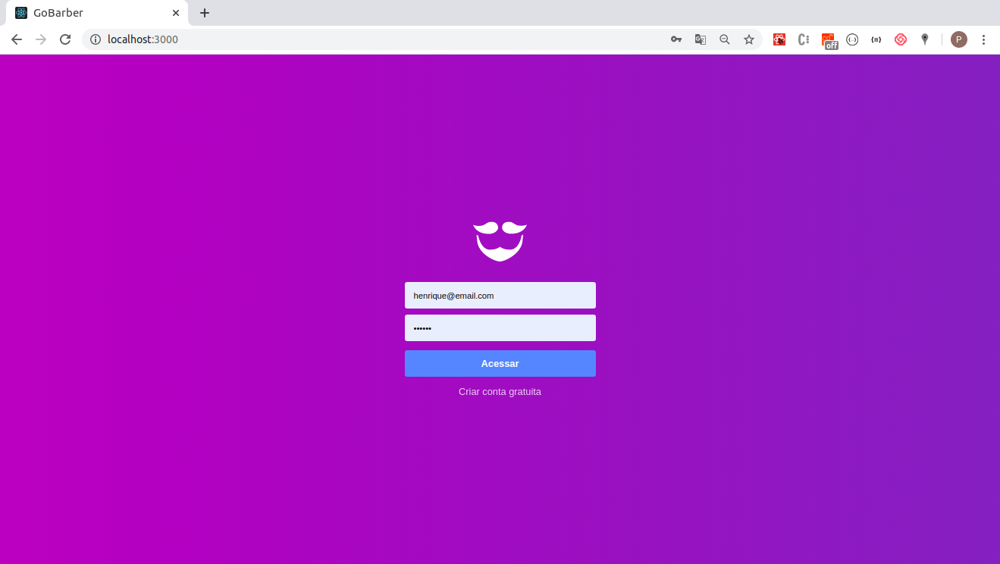

<h2 align="center">
    
    <br>
    GoBarber Web - Barbers Module
</h2>

<h4 align="center">
  Barber's web app to help manage his schedule.
</h4>




## Libs used

- [ReactJS](https://reactjs.org/)
- [Redux](https://redux.js.org/)
- [Redux-Saga](https://redux-saga.js.org/)
- [styled-components](https://www.styled-components.com/)
- [Axios](https://github.com/axios/axios)
- [History](https://www.npmjs.com/package/history)
- [Immer](https://github.com/immerjs/immer)
- [Polished](https://polished.js.org/)
- [React-Toastify](https://fkhadra.github.io/react-toastify/)
- [React-Icons](http://react-icons.github.io/react-icons/)
- [Unform](https://github.com/Rocketseat/unform)
- [Yup](https://www.npmjs.com/package/yup)
- [date-fns](https://date-fns.org/)
- [Reactotron](https://infinite.red/reactotron)

## Let's run

```bash
# Clone this repository
$ git clone https://github.com/paulohlips/gobarber_web

# Go into the repository
$ cd gobarber_web

# Install dependencies
$ yarn install

# Run the app
$ yarn start
```
